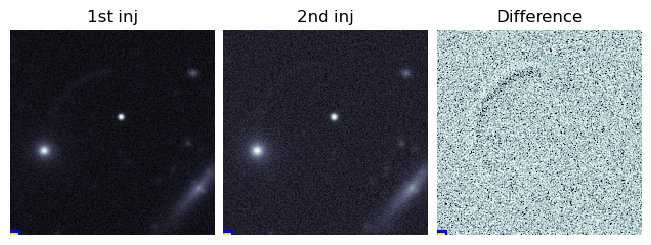

# Inject LE simulation on DP1 images

using the `lsst_stack = w_2025_31` on NERSC.

## How to create the DP1 coadds?
* `dp1_build_coadd.sh`: creates the coadds, the code that executes some parts of the step3 of the pipeline


## How to inject the LE simulations on the coadds?

### First, generate the LE image, and save it as a fits file 

The [repo](https://github.com/taceroc/lightecho_modeling_oop) on branch plane_simple_ners, contains the code to generate the LE.
(this doesn't need the lsst_stack)
```
python pipe_le.py SimulateLEInfPlane -file_to_parameters /pscratch/sd/t/taceroc/LE_inj/params_le_new_interpolation.yml --bool_save --no-bool_show_plots -file_to_parameters_surface /pscratch/sd/t/taceroc/LE_inj/name_surface.yml -loc_to_fits /pscratch/sd/t/taceroc/LE_inj/fits
```

#### Arguments:
* `-file_to_parameters`: the yml file that specifies the geometry of the plane, location of the source.
* `-file_to_parameters_surface`: just a temporary file to store the name of the surface's values, after the simulation
* `-loc_to_fits`: where to save the .fits file

### Second, inject the LE on the coadds

`python inject_diff_save_dp1.py`: This is still very manual, define which fits file to use, which coadd to use by editing the code

You have to load first the `lsst_stack`
```
export STACKCVMFS=/cvmfs/sw.lsst.eu/linux-x86_64/lsst_distrib
export LSST_STACK_VERSION=w_2025_31

module load cpu

source $STACKCVMFS/$LSST_STACK_VERSION/loadLSST-ext.bash
setup -t w_2025_31 lsst_distrib
```

This saves the numpy array of the two injected images and their difference, and also a .jpg image with the three images.



